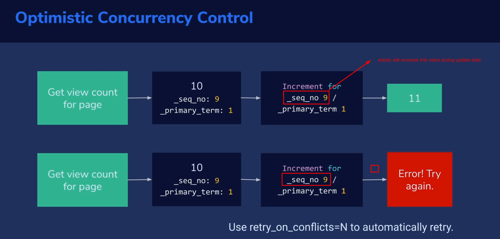

## I. Pre-requisite:
```bash
# normally we use elastic will using header: "Content-Type: application/json" then:

curl -u elastic:elastic -X PUT http://192.168.61.151:8080/movies \
-H "Content-Type: application/json" \
-d '{
  "mappings": {
    "dynamic_templates": [
      {
        "years_as_date": {
          "match": "years",
          "mapping": {
            "type": "date"
          }
        }
      }
    ]
  }
}'


# create new curl for without define -H header: "Content-Type: application/json" on curl request:
hand-ons/bin/curl -u elastic:elastic -X PUT http://192.168.61.151:8080/movies \
-d '{
  "mappings": {
    "dynamic_templates": [
      {
        "years_as_date": {
          "match": "years",
          "mapping": {
            "type": "date"
          }
        }
      }
    ]
  }
}'
```
## II. mapping:

### 1. concept:
```
A mapping is a schema definition elasticsearch has reasonable defaults, but sometimes you need to customize them
```

example:

```bash
curl -u elastic:elastic -XPUT http://192.168.61.151:8080/movies -d'
{
    "mappings": {
        "properties": {
            "years": {"type": "date"},
        }
    }
}'
```
### 2. common mappings:

#### 2.1 field types: `string, byte, short, integer, long, float, double, boolean, date`

```json
{
    "mappings": {
        "properties": {
            "years": {"type": "date"},
            "user_id": {"type": "long"}
        }
    }
}
```


#### 2.2 field index:
```json
// do you want to this field indexed for full-text search ?analyzed / not_analyzed / no
{
    "mappings": {
        "properties": {
            "genre": {
                "index": "not_analyzed"
            }
        }
    }
}
```

#### 2.3 field analyzer:
1. simple config:
```json
// Define you tokenizer and token filter. standard / whitespace / simple / english etc
{
    "mappings": {
        "properties": {
            "description": {
                "analyzer": "english"
            }
        }
    }
}'
```

2. more about analyzers

```
1. character filters:
remove HTML encoding, convert & to and

2. tokenizer:
split strings on whitespace / punctuation / non-letters

3. token filter:
lowercasing, stemming, synonyms, stopwords
```

3. choices for analyzers
```
1. standard:
splits on word boundaries, removes punctuation,
lowercases. good choice if language is unknown

2. simple:
splits on anything that isn’t a letter, and lowercases

3. whitespace:
splits on whitespace but doesn’t lowercase

4. language (i.e. english):
accounts for language-specific stopwords and
stemming
```

## III. insert single movie data via JSON/REST

### step-01: check available index:
```bash
# curl command
curl -u elastic:elastic http://192.168.61.151:8080/_cat/indices\?pretty

# results:
...
green open .internal.alerts-stack.alerts-default-000001                       X3ouSxdpSb6ijagigsDTPQ 1 1 0 0 498b 249b 249b
...
```

### step-02: create `movies` index and `mapping`:
```bash
hand-ons/bin/curl -u elastic:elastic -X PUT http://192.168.61.151:8080/movies \
-d '{
  "mappings": {
    "dynamic_templates": [
      {
        "years_as_date": {
          "match": "years",
          "mapping": {
            "type": "date"
          }
        }
      }
    ]
  }
}'
```

### step-03: check `index` and `mapping` created:
```bash
# get index command:
hand-ons/bin/curl -u elastic:elastic http://192.168.61.151:8080/_cat/indices\?pretty

# indices result:

...
green open movies                                                             gAge8MleRVGNOHBslJrGug 1 1 0 0 498b 249b 249b
...
green open .internal.alerts-stack.alerts-default-000001                       X3ouSxdpSb6ijagigsDTPQ 1 1 0 0 498b 249b 249b
...

# get mapping for index `movies`
hand-ons/bin/curl -u elastic:elastic http://192.168.61.151:8080/movies/_mapping\?pretty

# results:
'{
  "movies" : {
    "mappings" : {
      "dynamic_templates" : [
        {
          "years_as_date" : {
            "match" : "years",
            "mapping" : {
              "type" : "date"
            }
          }
        }
      ]
    }
  }
}'
```

### step-04: push single data to index:
```bash
hand-ons/bin/curl -u elastic:elastic -X PUT http://192.168.61.151:8080/movies/_doc/100001?pretty -d'
{
  "genre": ["discover", "historical drama"],
  "title": "journey to the west",
  "years": 1986
}
'
```

### step-05: Get all data:
1. step-05.1: command

```bash
hand-ons/bin/curl -u elastic:elastic -X GET http://192.168.61.151:8080/movies/_search?pretty
```

2. step-05.2: results
```json
{
  "took" : 2,
  "timed_out" : false,
  "_shards" : {
    "total" : 1,
    "successful" : 1,
    "skipped" : 0,
    "failed" : 0
  },
  "hits" : {
    "total" : {
      "value" : 1,
      "relation" : "eq"
    },
    "max_score" : 1.0,
    "hits" : [
      {
        "_index" : "movies",
        "_id" : "100001",
        "_score" : 1.0,
        "_source" : {
          "genre" : [
            "discover",
            "historical drama"
          ],
          "title" : "journey to the west",
          "years" : 1986
        }
      }
    ]
  }
}
```

### step-06: Get one data:
1. step-06.1: command

```bash
hand-ons/bin/curl -u elastic:elastic -X GET http://192.168.61.151:8080/movies/_doc/<id>?pretty
hand-ons/bin/curl -u elastic:elastic -X GET http://192.168.61.151:8080/movies/_doc/100001\?pretty
```

2. step-06.2: results
```json
{
  "_index" : "movies",
  "_id" : "100001",
  "_version" : 1,
  "_seq_no" : 0,
  "_primary_term" : 1,
  "found" : true,
  "_source" : {
    "genre" : [
      "discover",
      "historical drama"
    ],
    "title" : "journey to the west",
    "years" : 1986
  }
}
```

## IV. insert `many documents` - insert `bulk` data:

```json
// hand-ons/files/json/bulk_movies.json
{ "create" : { "_index" : "movies", "_id": "100002" } }
{"id": "100002", "title": "journey to the west 2003", "genre": ["discover", "historical drama"], "years": 2003 }
{ "create" : { "_index" : "movies", "_id": "100003" } }
{"id": "100003", "title": "All Men Are Brothers 2011", "genre": ["Action film", "historical drama"], "years": 2011 }
...
```

```bash
curl -u elastic:elastic -X POST "http://192.168.61.151:8080/_bulk" \
-H "Content-Type: application/json" \
--data-binary @/home/duongdx/Projects/elk-stack/hand-ons/files/json/bulk-movies.json
'
```

## V: `Update` data in elasticsearch

### 1. documents:
```
- Every document has a _version field
- Elasticsearch documents are immutable.
- When you update an existing document:
  + a new document is created with an incremented _version
  + the old document is marked for deletion
```

### 2. update command:

#### 2.1 method01
```bash
hand-ons/bin/curl -u elastic:elastic -X PUT http://192.168.61.151:8080/movies/_doc/100001?pretty -d'
{
  "title": "journey to the west 1986",
  "years": 1986
}
'

# result:
{
  "_index" : "movies",
  "_id" : "100001",
  "_version" : 2,
  "result" : "updated",
  "_shards" : {
    "total" : 2,
    "successful" : 2,
    "failed" : 0
  },
  "_seq_no" : 13,
  "_primary_term" : 1
}
```

#### 2.2 method02
```bash
hand-ons/bin/curl -u elastic:elastic -X POST "http://192.168.61.151:8080/movies/_update/100001" \
-d '{
  "doc": {
    "title": "journey to the west 1986_v2",
    "genre" : [
      "discover",
      "historical drama"
    ],
    "years": 1986
  }
}'
```


### 3: check updated data:
```bash
hand-ons/bin/curl -u elastic:elastic -X GET http://192.168.61.151:8080/movies/_doc/100001\?pretty

{
  "_index" : "movies",
  "_id" : "100001",
  "_version" : 2,
  "_seq_no" : 13,
  "_primary_term" : 1,
  "found" : true,
  "_source" : {
    "title" : "journey to the west 1986",
    "genre" : [
      "discover",
      "historical drama"
    ],
    "years" : 1986
  }
}
```

## VI: `Delete` data in elasticsearch
```bash
hand-ons/bin/curl -u elastic:elastic -X DELETE "http://192.168.61.151:8080/movies/_doc/100001?pretty"

# result:
{
  "_index" : "movies",
  "_id" : "100001",
  "_version" : 4,
  "result" : "deleted",
  "_shards" : {
    "total" : 2,
    "successful" : 2,
    "failed" : 0
  },
  "_seq_no" : 15,
  "_primary_term" : 1
}

```

## VII: Query data in elasticsearch:
```bash
hand-ons/bin/curl -u elastic:elastic -X GET "http://192.168.61.151:8080/movies/_search?q=west&pretty"

# result:
{
  "took" : 2,
  "timed_out" : false,
  "_shards" : {
    "total" : 1,
    "successful" : 1,
    "skipped" : 0,
    "failed" : 0
  },
  "hits" : {
    "total" : {
      "value" : 2,
      "relation" : "eq"
    },
    "max_score" : 1.7227666,
    "hits" : [
      {
        "_index" : "movies",
        "_id" : "100002",
        "_score" : 1.7227666,
        "_source" : {
          "id" : "100002",
          "title" : "journey to the west 2003",
          "genre" : [
            "discover",
            "historical drama"
          ],
          "year" : 2003
        }
      },
      {
        "_index" : "movies",
        "_id" : "100001",
        "_score" : 1.7227666,
        "_source" : {
          "title" : "journey to the west 1986_v2",
          "years" : 1986
        }
      }
    ]
  }
}
```

## VIII: Dealing with `Elasticsearch concurrency`



Testing concurrency:

### step-01: get current data: `_seq_no = 16`
```bash
hand-ons/bin/curl -u elastic:elastic -X GET "http://192.168.61.151:8080/movies/_doc/100001?pretty"
{
  "_index" : "movies",
  "_id" : "100001",
  "_version" : 1,
  "_seq_no" : 16,
  "_primary_term" : 1,
  "found" : true,
  "_source" : {
    "doc" : {
      "title" : "journey to the west 1986_v2",
      "genre" : [
        "discover",
        "historical drama"
      ],
      "years" : 1986
    }
  }
}
```

### step-02: update with `_seq_no = 16` then `_seq_no = 17`
```bash
hand-ons/bin/curl -u elastic:elastic -X PUT "http://192.168.61.151:8080/movies/_doc/100001?if_seq_no=16&if_primary_term=1&pretty" \
-d '{
  "doc": {
    "title": "journey to the west 1986_v3",
    "genre" : [
      "discover",
      "historical drama"
    ],
    "years": 1986
  }
}'

{
    "_index": "movies",
    "_id": "100001",
    "_version": 2,
    "result": "updated",
    "_shards": {
        "total": 2,
        "successful": 2,
        "failed": 0
    },
    "_seq_no": 17,
    "_primary_term": 1
}
```

### step-03: update with `_seq_no = 16`  AGAIN then `Error`
```bash
hand-ons/bin/curl -u elastic:elastic -X PUT "http://192.168.61.151:8080/movies/_doc/100001?if_seq_no=16&if_primary_term=1&pretty" \
-d '{
  "doc": {
    "title": "journey to the west 1986_v3",
    "genre" : [
      "discover",
      "historical drama"
    ],
    "years": 1986
  }
}'
{
  "error" : {
    "root_cause" : [
      {
        "type" : "version_conflict_engine_exception",
        "reason" : "[100001]: version conflict, required seqNo [16], primary term [1]. current document has seqNo [17] and primary term [1]",
        "index_uuid" : "gAge8MleRVGNOHBslJrGug",
        "shard" : "0",
        "index" : "movies"
      }
    ],
    "type" : "version_conflict_engine_exception",
    "reason" : "[100001]: version conflict, required seqNo [16], primary term [1]. current document has seqNo [17] and primary term [1]",
    "index_uuid" : "gAge8MleRVGNOHBslJrGug",
    "shard" : "0",
    "index" : "movies"
  },
  "status" : 409
}
```

### step-04: update with `retry_on_conflict` option:
```bash
hand-ons/bin/curl -u elastic:elastic -X POST "http://192.168.61.151:8080/movies/_update/100001?retry_on_conflict=5&pretty" \
-d '{
  "doc": {
    "title": "journey to the west 1986_v6",
    "genre" : [
      "discover",
      "historical drama"
    ],
    "years": 1986
  }
}'
{
  "_index" : "movies",
  "_id" : "100001",
  "_version" : 3,
  "result" : "updated",
  "_shards" : {
    "total" : 2,
    "successful" : 2,
    "failed" : 0
  },
  "_seq_no" : 18,
  "_primary_term" : 1
}
```

## IX: Using `analyzers` and `Tokenizers`:

### step-01: add new record:
```bash
hand-ons/bin/curl -u elastic:elastic -X PUT "http://192.168.61.151:8080/movies/_doc/100016?pretty" \
-d '{
  "doc": {
    "title": "Condor novel: Heavenly Sword and Dragon Slaying Sabre 2009",
    "genre" : [
      "Action film",
      "wuxia"
    ],
    "years": 2009
  }
}'
```

### step-02: searching for testing - with: `genre: wuxia`
```bash
hand-ons/bin/curl -u elastic:elastic -X GET "http://192.168.61.151:8080/movies/_search?pretty" -d '
{
  "query": {
    "match": {
      "genre": "wuxia"
    }
  }
}'

{
  "took" : 1,
  "timed_out" : false,
  "_shards" : {
    "total" : 1,
    "successful" : 1,
    "skipped" : 0,
    "failed" : 0
  },
  "hits" : {
    "total" : {
      "value" : 3,
      "relation" : "eq"
    },
    "max_score" : 1.4900502,
    "hits" : [
      {
        "_index" : "movies",
        "_id" : "100006",
        "_score" : 1.4900502,
        "_source" : {
          "id" : "100006",
          "title" : "The Legend Of The Condor Heroes 2003",
          "genre" : [
            "Action film",
            "wuxia"
          ],
          "year" : 2003
        }
      },
      {
        "_index" : "movies",
        "_id" : "100007_1",
        "_score" : 1.4900502,
        "_source" : {
          "id" : "100007",
          "title" : "The Legend Of The Condor Heroes 2018",
          "genre" : [
            "Action film",
            "wuxia"
          ],
          "year" : 2018
        }
      },
      {
        "_index" : "movies",
        "_id" : "100007_2",
        "_score" : 1.4900502,
        "_source" : {
          "id" : "100007",
          "title" : "The Return of the Condor Heroes 2006",
          "genre" : [
            "Action film",
            "wuxia"
          ],
          "year" : 2006
        }
      }
    ]
  }
}
'
```

### step-03: searching for testing - with: `title: Condor Heroes`
```bash
hand-ons/bin/curl -u elastic:elastic -X GET "http://192.168.61.151:8080/movies/_search?pretty" -d '
{
  "query": {
    "match": {
      "title": "Condor Heroes"
    }
  }
}'

{
  "took" : 1,
  "timed_out" : false,
  "_shards" : {
    "total" : 1,
    "successful" : 1,
    "skipped" : 0,
    "failed" : 0
  },
  "hits" : {
    "total" : {
      "value" : 3,
      "relation" : "eq"
    },
    "max_score" : 1.4900502,
    "hits" : [
      {
        "_index" : "movies",
        "_id" : "100006",
        "_score" : 1.4900502,
        "_source" : {
          "id" : "100006",
          "title" : "The Legend Of The Condor Heroes 2003",
          "genre" : [
            "Action film",
            "wuxia"
          ],
          "year" : 2003
        }
      },
      {
        "_index" : "movies",
        "_id" : "100007_1",
        "_score" : 1.4900502,
        "_source" : {
          "id" : "100007",
          "title" : "The Legend Of The Condor Heroes 2018",
          "genre" : [
            "Action film",
            "wuxia"
          ],
          "year" : 2018
        }
      },
      {
        "_index" : "movies",
        "_id" : "100007_2",
        "_score" : 1.4900502,
        "_source" : {
          "id" : "100007",
          "title" : "The Return of the Condor Heroes 2006",
          "genre" : [
            "Action film",
            "wuxia"
          ],
          "year" : 2006
        }
      }
    ]
  }
}
```

### step-04: remapping:
```bash
hand-ons/bin/curl -u elastic:elastic -X PUT "http://192.168.61.151:8080/movies?pretty" -d '
{
  "mappings": {
    "properties": {
      "id": { "type": "integer" },
      "title": { "type": "text", "analyzer": "english" },
      "genre": { "type": "keyword" },
      "year": { "type": "date" }
    }
  }
}'
```